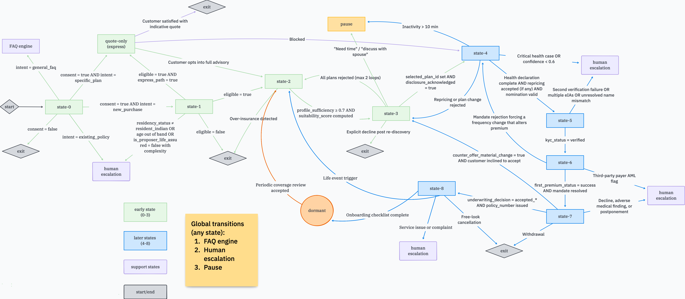

# SurakshaSetu

An AI-assisted conversational advisor for life and term insurance in India. It guides a customer from consent, through eligibility and needs discovery, to a compliant, explainable plan recommendation.

> **🚧 Work in progress.** Steps 1–4 of 21 are done: a runnable skeleton, core local infrastructure, CI, the database migrations, the OpenAPI contract between the two tiers, per-customer encryption keys, and a tamper-evident audit trail anchored daily in locked storage. There's no business logic yet. Phase 1 targets journey states S0–S3.

## Core idea

- **The LLM handles language only.** It interprets what the customer says and explains results.
- **Every decision is deterministic.** Eligibility, suitability, cover sizing, premiums, ranking and state transitions come from versioned rule services, so an auditor can reproduce any recommendation from its inputs.
- **Legally significant text comes from templates.** Consent notices, disclosures and hand-off scripts are never generated, and every mandatory disclosure is recorded in a hash-chained audit ledger.
- **Consent comes first.** No data is stored and no service is called before the customer consents, and a withdrawal takes effect in the same turn.

## Conversation journey

| State | Stage                                            | Phase |
| ----- | ------------------------------------------------ | ----- |
| S0    | Greeting, AI disclosure and consent              | 1     |
| S1    | Rapport and eligibility screening                | 1     |
| S2    | Needs discovery and suitability assessment       | 1     |
| S3    | Plan recommendation, comparison and disclosures  | 1     |
| S4    | Application intake and health declaration        | 2     |
| S5    | Identity verification and KYC                    | 2     |
| S6    | Payment authorisation and mandate                | 2     |
| S7    | Underwriting liaison                             | 3     |
| S8    | Post-sale onboarding                             | 3     |

These layers work across every state: FAQ engine, objection handler, human escalation, pause/resume, and data erasure.



_State flow from the product spec. Phase 1 builds only S0–S3 (green) and hands off to the existing application journey instead of S4._

## Repository layout

| Path               | What it holds                                                                          |
| ------------------ | -------------------------------------------------------------------------------------- |
| `orchestrator/`    | Conversation tier: Python 3.12, FastAPI and LangGraph                                  |
| `domain-services/` | Domain tier: Java 21, Spring Boot and DMN rules (eligibility, suitability, consent, catalog) |
| `tools/stubs/`     | Local stand-ins for the model and external systems                                     |
| `infra/`           | Docker Compose stack (Postgres, Valkey, Qdrant, MinIO) and Flyway migrations           |

## Quick start

Prerequisites: [uv](https://docs.astral.sh/uv/), Docker, and JDK 21.

```sh
make up          # start the core stack and wait for healthchecks
make db-migrate  # apply schemas, roles and grants
make check       # lint, type-check and test all tiers
make down        # stop the stack
```

## Note

All reference data is fictitious, including product UINs, disclosure sets and knowledge-base content.
