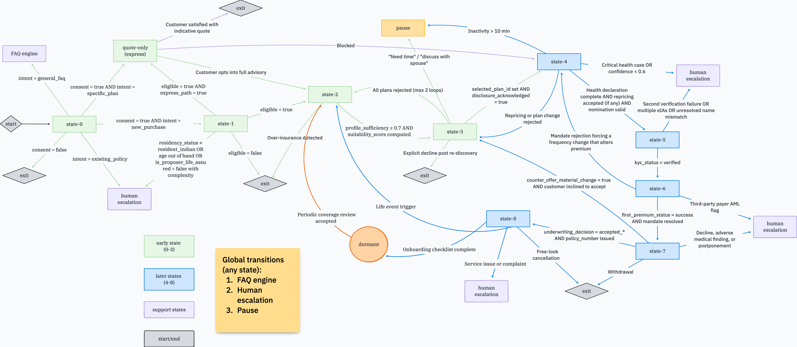

# SurakshaSetu

An AI-assisted conversational advisor for life and term insurance in India. It guides a customer from consent, through eligibility and needs discovery, to a compliant, explainable plan recommendation.

> **Phase 1, Steps 1–23 of 24 done.** The whole S0–S3 journey works end to end: consent, eligibility, the Quote-Only path, needs discovery, a ranked and cited recommendation with hash-verified disclosures, and a signed hand-off to the application journey. The cross-cutting handlers (FAQ, objections, human escalation, pause, data erasure) also work. `make eval` passes 207 of 207 golden and red-team conversations, with 0 of 157 attacks succeeding. Every product, rule, rate and document is DUMMY data, and the language models are local stubs until the hosting decision (D2). Step 24 (audit streaming, observability, retention, the compliance dossier) is next.

## Core idea

- **The LLM handles language only.** It interprets what the customer says and explains results.
- **Every decision is deterministic.** Eligibility, suitability, cover sizing, premiums, ranking and state transitions come from versioned rule services, so an auditor can reproduce any recommendation from its inputs.
- **Legally significant text comes from templates.** Consent notices, disclosures and hand-off scripts are never generated, and every mandatory disclosure is recorded in a hash-chained audit ledger.
- **Consent comes first.** No data is stored and no service is called before the customer consents, and a withdrawal takes effect in the same turn.

## Conversation journey

| State | Stage                                            | Phase |
| ----- | ------------------------------------------------ | ----- |
| S0    | Greeting, AI disclosure and consent              | 1     |
| S1    | Rapport and eligibility screening                | 1     |
| S2    | Needs discovery and suitability assessment       | 1     |
| S3    | Plan recommendation, comparison and disclosures  | 1     |
| S4    | Application intake and health declaration        | 2     |
| S5    | Identity verification and KYC                    | 2     |
| S6    | Payment authorisation and mandate                | 2     |
| S7    | Underwriting liaison                             | 3     |
| S8    | Post-sale onboarding                             | 3     |

These layers work across every state: FAQ engine, objection handler, human escalation, pause/resume, and data erasure.



_State flow from the product spec. Phase 1 builds only S0–S3 (green) and hands off to the existing application journey instead of S4._

## Repository layout

| Path               | What it holds                                                                          |
| ------------------ | -------------------------------------------------------------------------------------- |
| `orchestrator/`    | Conversation tier: Python 3.12, FastAPI and LangGraph                                  |
| `domain-services/` | Domain tier: Java 21, Spring Boot and DMN rules (eligibility, suitability, consent, catalog) |
| `tools/stubs/`     | Local stand-ins for the model and external systems                                     |
| `infra/`           | Docker Compose stack (Postgres, Valkey, Qdrant, MinIO, TEI, OmniRoute) and Flyway migrations |

## Quick start

Prerequisites: [uv](https://docs.astral.sh/uv/), Docker, and JDK 21.

```sh
make local-setup  # TDD §7.5 steps 1-5: stack, gateway, catalog, knowledge base, eval sets,
                  # invariant tests and the scripted S0-S3 conversation (first run: ~40 min of downloads)
make serve        # the Conversation API on 127.0.0.1:8000 (leave it running)
```

Then chat with it in a second terminal:

```sh
cd orchestrator && uv run python scripts/chat.py            # --locale hi-IN for Hindi
```

Type a number to pick a quick reply, `f` to fill the consent form, `/erase` to delete your data, `/quit` to leave.

Other targets:

```sh
make check        # lint, type-check and test all tiers
make eval         # every golden and red-team conversation, then the TDD §5.2/§5.3 gates (~13 min)
make e2e-scripted # the scripted S0-S3 conversation alone, ending in the signed hand-off
make down         # stop the stack
```

### Demo notes

- The models are stubs, so their wording is canned and free text is understood only by the deterministic parsers. Use the quick replies and short answers ("34", "411001", "no", "12 lakh"); the seed pincodes are in `content/seed/catalog/reference.yaml`.
- Retrieval recall and precision for the regulatory and tax collections show as WAIVED in the eval report: they miss their targets on the DUMMY corpus until the reranker decision.

## Note

All reference data is fictitious, including product UINs, disclosure sets and knowledge-base content.
